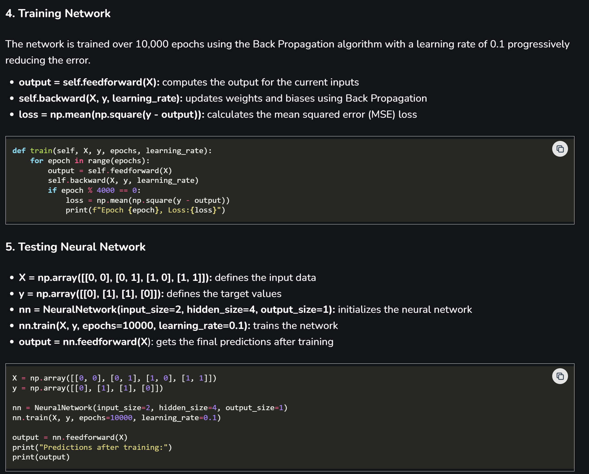

# Changelog

All notable changes to this project will be documented in this file.

The format is based on [Keep a Changelog](https://keepachangelog.com/en/1.1.0/),
and this project adheres to [Calendar Versioning](https://calver.org/) of
the following form: YYYY.0M.0D.
## [2025.11.20]
- I created a method which checks the range of the index the weights are being placed in. I'm not sure if it will ever go out of bounds but in the chance that it does it will throw an exception when it does that. Also Getting result from my project and it seems like my results are doing the correct updating of the weights though I'm getting a pretty big numbers for my bias which seem okay since they get lower after a certain number of cycles.
## [2025.11.7]
- Major changes to my project. First I added a abstract class method where I move some of my methods like train, sigmoid function, fowardPass, and some unimplemented methods in.
- Created a Secondary Neuron class that implements the Neuron interface. This class is used by the main Neuron1 class to encapsulate some of the methods so that neuron1 is more readable.
- Had to redo the train method as I am starting to do the main method, I read further into this document about "training" https://www.geeksforgeeks.org/machine-learning/backpropagation-in-neural-network/. So basically the actual training portion of my "Network" even though its only 2 neurons that I am training. The hardest part about the training in the main class was actually understanding the documentation. So in the documentation its done in python with probably a bunch of libraries that I can't use in java. So it took me a long time to do this.
  ## To break down what is happening in the main method:
    - 
    GeeksforGeeks is where I got this image from scroll all the way to the bottom https://www.geeksforgeeks.org/machine-learning/backpropagation-in-neural-network/

    - I was using this image as a sort of backbone of what I needed to do for my training portion because honestly I had zero idea how I was going to do this. I have zero background knowledge prior to doing this project so I need some refrences.
    - The variable X is a 2D list representing basically a truth table. You learn the basics of this in foundations 1 at Ohio State University or in Discrete Math if you are at a different university. In short this training is solving an XOR problem. We want our results to basically be as close to the results of this truth table.
    - The next big challege was how I was going to put the data into a "Sequence" since that is the data structure I am using for this project. So what I did was for every cycle it adds the numbers from the 2D list into a sequence and will do it four times every cycle. It will then train on each pair and add to the loss of each training. After its completes the training, it will create a new sequence every time so each input gets a clean empty sequence.

## [2025.10.23]

- Added 2 interfaces files to my project. One is the main interface with the second one
being a secondary or sub interface that is used within the main interface.
- The main interface is called NeuronKernel and the secondary interface is called Neuron.
- Moved all the methods from main.java file to the Neuron1 class file.
- Added kernel methods to the neuron1 class file.
- Added javadoc comments.

## [2025.10.9]

- Added a main method int he proof-of-concept branch and coded a very basic function that computes the weight using forward propagation and also computes the sigmoid. I'll also paste the links here as well where I got the formulas from and also the website has amazing information about the formulas and viusals.

  Here are the links I used for the formulas:

- https://www.geeksforgeeks.org/artificial-intelligence/artificial-neural-networks-and-its-applications/
- https://www.geeksforgeeks.org/machine-learning/backpropagation-in-neural-network/
- https://www.geeksforgeeks.org/machine-learning/derivative-of-the-sigmoid-function/

## [2024.12.30]

- Added table-based rubrics to all 6 parts of the project
- Updated gitignore to exclude more files
- Fixed image markdown in the interfaces document

## [2024.08.07]

### Added

- Added `/bin` to `.gitignore`, so binaries are no longer committed
- Added the TODO tree extensions to `extensions.json`
- Added the `todo-tree.general.showActivityBarBadge` setting to `settings.json`
- Added the `todo-tree.tree.showCountsInTree` setting to `settings.json`
- Added the VSCode PDF extension to `extensions.json`
- Added `java.debug.settings.vmArgs` setting to enable assertions (i.e., `-ea`)
- Added information about making branches to all parts of the project
- Added information about how to update the CHANGELOG to every part of the
  project
- Added information about how to make a pull request to every part of the
  project

### Changed

- Updated `settings.json` to format document on save using `editor.formatOnSave`
  setting
- Updated `settings.json` to exclude certain files from markdown to PDF
  generation using `markdown-pdf.convertOnSaveExclude` setting
- Updated `settings.json` to use latest `java.cleanup.actions` setting
- Updated `settings.json` to automatically choose line endings using `files.eol`
  setting
- Updated `settings.json` to organize imports automatically on save using the
  `editor.codeActionsOnSave` and `source.organizeImports` settings
- Changed the component brainstorming assignment to ask a few clarifying
  questions
- Changed the component brainstorming example from `Point3D` to `NaturalNumber`
  to avoid the getter/setter trend
- Updated assignment feedback sections to include a link to a survey that
  I'll actually review
- Updated README to include step about using template repo
- Updated part 3 rubric to include a hierarchy diagram
- Updated part 6 rubric to account for overall polish

### Fixed

- Fixed issue where checkstyle paths would not work on MacOS

### Removed

- Removed `java.saveActions.organizeImports` setting from `settings.json`
- Removed references to `Point3D` completely

## [2024.01.07]

### Added

- Added a list of extensions to capture the ideal student experience
- Added PDFs to the `.gitignore`
- Added the OSU checkstyle config file
- Added the OSU formatter config file
- Added a `settings.json` file to customize the student experience
- Created a README at the root to explain how to use the template repo
- Created initial drafts of the six portfolio assessments
- Added READMEs to key folders like `test` and `lib` to explain their purpose

[unreleased]: https://github.com/jrg94/portfolio-project/compare/v2024.08.07...HEAD
[2024.08.07]: https://github.com/jrg94/portfolio-project/compare/v2024.01.07...v2024.08.07
[2024.01.07]: https://github.com/jrg94/portfolio-project/releases/tag/v2024.01.07
